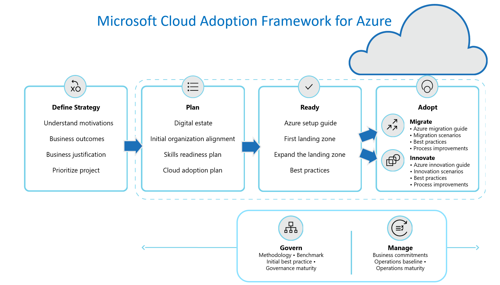

# Simplified azure cloud adoption framework

The Cloud Adoption Framework helps customers undertake a simplified cloud adoption journey. The framework contains detailed information about an end-to-end cloud adoption journey and is designed primarily for cloud architects and the cloud strategy teams leading cloud adoption efforts. This blog post primarily focus on step-by-step checklist that can help you complete your journey based on Microsoft azure cloud adoption framework recommended practices.

\#WIP

