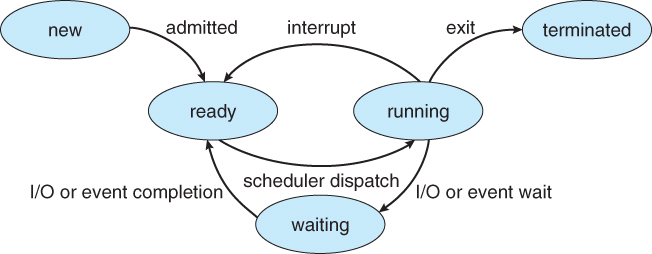

# Implementing state machine behavior using F\#

State Machine simulation is one of most common practices. It is not a coding-oriented design pattern, but it is system-oriented, often used to model cases for business use. Using F\# and domain driven driven design we can not only define different type to represent state but we can define behavior as function with various state transition rules.

For example given a current state X, a state machine will define what a new state X can change to, and what events can cause state changes to occur. i.e. Current State -&gt; Event -&gt; New State

In our scenario we have various states and transition events of a process in an operating system viz.

```text
module Process
    module StateMachine
        type ProcessState =
            | New
            | Ready
            | Running
            | Waiting
            | Terminated
        
        type ProcessEvent
            | Admit
            | Interrupt
            | SchedulerDispatch
            | IOEventWait
            | IOEventCompletion
            | Exit
```



Let us create a state machine function that can provide the transition based on current state and event. It will be a simple pattern matching to identify the new state.

```text
let stateMachine (state, event) =
    match state, event with
    | New, Admit
        -> Ready
    | Ready, SchedulerDispatch
        -> Running
    | Running, IOEventWait
        -> Waiting
    | Running, Exit
        -> Terminated
    | Running, Interrupt
        -> Ready
    | Waiting, IOEventCompletion
        -> Ready
    | _
        -> failwith  "Invalid Transition"
```

The above function can provide behavior for transition but it has an issue, it will allow us to raise an event which might not be allowed by state such as ADMIT event when the state is WAITING. This can lead to run time exception "Invalid Transition". Thus a better way to provide implementation for the above code is to replace with following code. First we create two helper function, stateTransition that will event and return the future state and getEventForState that will take the current state and return the possible event it can raise.

```text
let private stateTransition event =
    match event with
    | Admit
        -> Ready
    | SchedulerDispatch
        -> Running
    | IOEventWait
        -> Waiting
    | Exit
        -> Terminated
    | Interrupt
        -> Ready
    | IOEventCompletion
        -> ready
        
let private getEventForState state =
    match state with
    | New
        ->[|Admit|]
    | Ready
        -> [|SchedulerDispatch|]
    | Running
        -> [|IOEventWait, Interrupt, Exit|]
    | Waiting
        -> [|IOEventCompletion|]
```

Now we need a circular reference type that can be used to hold the allowed event record with a identification property and a method function that takes a unit and returns allowed event results with current state details.

```text
type AllowedEvent = 
        {
                EventInfo : ProcessEvent
                RaiseEvent : unit -> EventResult
        }
and EventResult
        {
                CurrentState : ProcessState
                AllowedEvents : AllowedEvent array
        }
```

In the above definition AllowedEvent references EventResult in RaiseEvent and EventResult references AllowedEvent in AllowedEvents. Please give attention that both functions stateTransition and getEventForState were private to module.

Let us implement final state machine function

```text
let rec stateMachine event =
    let newState = stateTransition event
    let newEvents = getEventForState newState
    {
        CurrentState = newState
        AllowedEvents = 
            newEvents
            |> Array.map (fun e ->
                let f() = stateMachine e
                {
                    EventInfor e
                    RaiseEvent = f
                })
    }
```

This is recursive function as it is self referencing and returns EventResult type. The stateMachine function takes the event and calculates newState and newEvent method the create EventResult. The AllowedEvent array create a special map of functions be called at runtime for transitioning between state from outside the module. By implementing above code we can utilise the result from each RaiseEvent to traverse further.

To complete the the above implementation we would provide a method to be accessed publicly and it will give us initial object to state the machine

```text
let init() = stateMachine New
```

To test the implementation we can now proceed as

```text
let result = init()
let result1 = result.AllowedEvents.[0].raiseEvent()
```

This methodology ensures that every time we raise an events it is a valid event.

