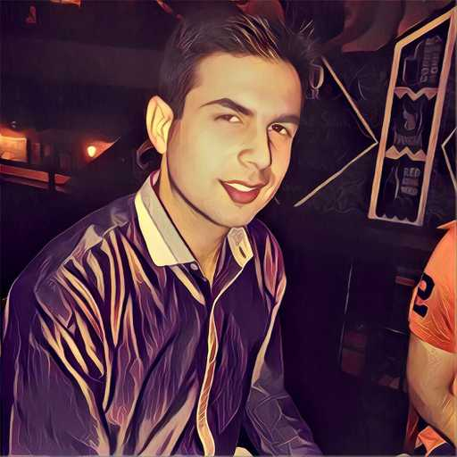

# PAUL BLOG

| Hi, welcome to my personal website, software engineering blog and dumping ground for my learnings. I'm bipin, a software developer, entrepreneur and open source contributor who's originally from New Delhi, India and currently living in the Sydney, Australia. Over the course of my career I've had the pleasure of working with a wealth of different technologies for various sized companies, mainly operating in very agile teams following Scrum or Kanban, using continuous deployment and most major clouds \(AWS, Google and Azure\) to deliver mission critical software. I was also lucky enough to lead and manage a team of highly skilled engineers building large scale enterprise systems. After almost 10 years in the corporate world, numerous battle scars and a growing appetite for a new adventure I finally threw the towel in 2019, decided to take more risks in life. Today I maintain several open source projects, contract on a side whilst also trying to set up my own start-up from the ground up. If I'm not busy building something technical then I'm probably doing sports \(basketball, skating, swimming\), reading a book or traveling. I also experiment a lot in cooking and tasting different cuisines and coffee , which means that I spend a fair amount of my time exploring new coffee shops and restaurants in Sydney and around the world. However, besides all of these hobbies my absolute favourite downtime activity is a round of board games with friends and family, though not many people know about this. |
| :--- |

